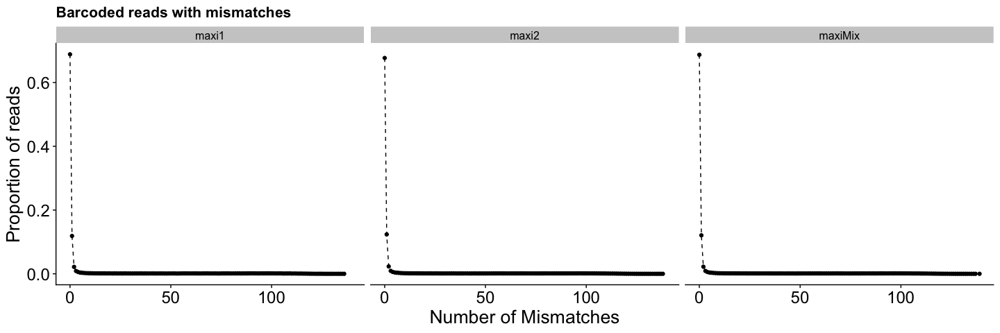

Representation of oligos
================
Taeyoung Hwang

This R script shows an example of how to check the representation of
oligos after ePCR/Cloning/Transfection.

# 0\. Libraries required

``` r
library(ggplot2)
library(cowplot)
library(reshape2)
```

``` r
theme_set(theme_cowplot())
```

# 1\. Import data

### Design files

``` r
temp <- read.table("/Volumes/rinnlab/Taeyoung/MPRNA/OligoPool/ezh2_oligoPool2.fasta", header=F, sep="\n", stringsAsFactors = F)[,1]
temp <- temp[seq(1,length(temp),2)] # keep only header
oligoPool.design <- data.frame(designID = unique(sapply(strsplit(substr(temp,2,100), split="_"), "[[", 1)), stringsAsFactors = F) # keep only designID
oligoPool.design$gene_name <- sapply(strsplit(oligoPool.design$designID, split=":"), "[[", 1)
```

### Pipeline output

``` r
load("/Volumes/rinnlab/Taeyoung/MPRNA/batch19_count.Rdata")
```

  - align.qc : list of alignment qc for samples
  - count : list of count matrix for samples

# 2\. Alignment QC

### Total number of reads

``` r
align.qc[["Total"]]
```

    ##    maxi1    maxi2  maxiMix 
    ## 36376611 45894317 42709564

### Unmapped rate

``` r
align.qc[["Unmapped"]] / align.qc[["Total"]]
```

    ##      maxi1      maxi2    maxiMix 
    ## 0.02405766 0.02379305 0.02306455

### Mapped rate

Barplot

``` r
p <- ggplot(subset(align.qc[["Mapped"]], MismatchNum>=0), aes(x=MismatchNum, y=Prop)) + facet_grid(.~Sample)
p <- p + geom_point() + geom_line(linetype = "dashed")
p <- p + xlab("Number of Mismatches") + ylab("Proportion of reads")
p <- p + theme(axis.title = element_text(size=20), axis.text=element_text(size=18))
p + ggtitle("Barcoded reads with mismatches")
```

<!-- -->

Detail number of reads per mismatches whose proportion \> 1%

``` r
subset(subset(align.qc[["Mapped"]], MismatchNum>=0), Prop>=0.01)
```

    ##           MismatchNum   Number  Sample       Prop
    ## maxi1.2             0 25042106   maxi1 0.68841229
    ## maxi1.3             1  4319295   maxi1 0.11873825
    ## maxi1.4             2   793124   maxi1 0.02180313
    ## maxi2.2             0 31068738   maxi2 0.67696264
    ## maxi2.3             1  5672181   maxi2 0.12359223
    ## maxi2.4             2  1062497   maxi2 0.02315095
    ## maxiMix.2           0 29342385 maxiMix 0.68702141
    ## maxiMix.3           1  5158339 maxiMix 0.12077714
    ## maxiMix.4           2   950149 maxiMix 0.02224675

# 3\. Representation of oligos

### Count matrix to table

``` r
count.table <- lapply(count, function(x) {melt(x, varnames=c("designID", "barcodeID"), value.name="count")})
count.table <- do.call(rbind, count.table)
count.table$designID <- factor(count.table$designID, levels=oligoPool.design$designID)
count.table$sample <- sapply(strsplit(rownames(count.table), split="[.]"), "[[", 1)
```

features of interest from oligoPool.design

``` r
idx <- match(count.table$designID, oligoPool.design$designID)
count.table$gene_name <- oligoPool.design$gene_name[idx]
```

### Distribution of reads per oligo

``` r
p <- ggplot(count.table, aes(log10(count+1))) + facet_grid(.~sample)
p <- p + geom_histogram()
p <- p + xlab("Log10 (count+1)") + ylab("Number of oligos")
p <- p + theme(axis.title = element_text(size=20), axis.text=element_text(size=18))
p + ggtitle("Distribution of oligos")
```

    ## `stat_bin()` using `bins = 30`. Pick better value with `binwidth`.

<!-- --> Note
that this pool (EZH2) has 3714\*15=56115 oligos.

### Number of barcodes that have no read per tile

#### Plot

``` r
temp <- subset(count.table, count==0)
temp <- dcast(temp, designID~sample, value.var = "barcodeID", fun.aggregate = length)
temp <- melt(temp, id.vars = "designID", variable.name = "sample", value.name="number")
temp$gene_name <- oligoPool.design$gene_name[match(temp$designID, oligoPool.design$designID)]

p <- ggplot(temp, aes(x=designID, y=number)) + facet_grid(sample~.,)
p <- p + geom_point(aes(col=gene_name), size=1.5)
p <- p + ylim(0, ncol(count[[1]]))
p <- p + geom_hline(yintercept = ncol(count[[1]]), linetype="dashed")
p <- p + theme(axis.title = element_text(size=20), axis.text=element_text(size=18))
p <- p + theme(axis.text.x=element_blank())
p <- p + theme(legend.position="none")
p + xlab("Design ID") + ylab("Number of barcodes that have no read")
```

<!-- --> Note
that this pool (EZH2) has 15 barcodes per a tile. A color indicates a
gene.

#### Summary by gene: number of tiles whose y-axis values are zero in the plot

``` r
temp <- subset(temp, number==0)
temp <- as.data.frame.matrix(table(temp$gene_name, temp$sample))

qc.zeroTile <- as.data.frame(table(oligoPool.design$gene_name))
colnames(qc.zeroTile) <- c("gene_name", "tileNum")
qc.zeroTile <- cbind(qc.zeroTile, temp[match(qc.zeroTile$gene_name, rownames(temp)),])
qc.zeroTile[which(is.na(qc.zeroTile), arr.ind = T)] <- 0
qc.zeroTile
```

    ##             gene_name tileNum maxi1 maxi2 maxiMix
    ## ADRB1           ADRB1      38     0    21      22
    ## BBC3             BBC3     151     0    81      83
    ## CDKN2B-AS1 CDKN2B-AS1      49     0    41      40
    ## CLCNKB         CLCNKB     174     0    94      94
    ## COX7C           COX7C      38     0    30      28
    ## DBX1             DBX1      55     0    25      24
    ## DIO3             DIO3      26     0    12      12
    ## DLL3             DLL3     122     0    81      81
    ## DMRT2           DMRT2      92     0    59      57
    ## EMX1             EMX1     222     0   156     156
    ## FENDRR         FENDRR      39     0    28      29
    ## FSCN2           FSCN2     112     0    67      62
    ## GAS5             GAS5       9     0     8       8
    ## GDF15           GDF15      38     0    24      24
    ## HIST1H2BC   HIST1H2BC       5     0     3       3
    ## HOTAIR         HOTAIR      30     0    26      25
    ## HOXA2           HOXA2      29     0    21      21
    ## HOXA7           HOXA7      37     0    19      21
    ## HOXA9           HOXA9      39     0    28      28
    ## HOXC6           HOXC6     178     0   108     107
    ## MLNR             MLNR      26     0    15      15
    ## MSX2             MSX2      80     0    52      51
    ## NEAT1           NEAT1     291     0   190     190
    ## NKX2-2         NKX2-2      38     0    23      23
    ## NKX2-5         NKX2-5      39     0    24      24
    ## NR2F2           NR2F2     182     0   117     118
    ## OTP               OTP     128     0    66      71
    ## PAX9             PAX9     259     0   160     158
    ## PDLIM2         PDLIM2     247     0   147     148
    ## RPS27           RPS27      17     0    15      15
    ## SHOX2           SHOX2     130     0    90      86
    ## SIX1             SIX1      77     0    48      49
    ## SSTR4           SSTR4      16     0     7       7
    ## TBR1             TBR1     122     0    77      75
    ## TBX3             TBX3     178     0   131     131
    ## TINCR           TINCR     126     0    79      79
    ## WNT1             WNT1      55     0    33      33
    ## XIST             XIST     247     0   180     175

### Number of barcodes that have reads more than 10

#### Plot

``` r
temp <- subset(count.table, count>=10)
temp <- dcast(temp, designID~sample, value.var = "barcodeID", fun.aggregate = length)
temp <- melt(temp, id.vars = "designID", variable.name = "sample", value.name="number")
temp$gene_name <- oligoPool.design$gene_name[match(temp$designID, oligoPool.design$designID)]

p <- ggplot(temp, aes(x=designID, y=number)) + facet_grid(sample~.,)
p <- p + geom_point(aes(col=gene_name), size=1.5)
p <- p + ylim(0, ncol(count[[1]]))
p <- p + geom_hline(yintercept = 10, linetype="dashed")
p <- p + theme(axis.title = element_text(size=22), axis.text=element_text(size=18))
p <- p + theme(axis.text.x=element_blank())
p <- p + theme(legend.position="none")
p + xlab("Design ID") + ylab("Number of barcodes whose counts >= 10")
```

<!-- --> Note
that this pool (EZH2) has 15 barcodes per a tile. A color indicates a
gene.

#### Summary by gene: number of tiles whose y-axis values are more than or equal to 10

``` r
temp <- subset(temp, number>=10)
temp <- as.data.frame.matrix(table(temp$gene_name, temp$sample))

qc.passTile <- as.data.frame(table(oligoPool.design$gene_name))
colnames(qc.passTile) <- c("gene_name", "tileNum")
qc.passTile <- cbind(qc.passTile, temp[match(qc.passTile$gene_name, rownames(temp)),])
qc.passTile[which(is.na(qc.passTile), arr.ind = T)] <- 0
qc.passTile
```

    ##             gene_name tileNum maxi1 maxi2 maxiMix
    ## ADRB1           ADRB1      38    19    31      31
    ## BBC3             BBC3     151   110   133     132
    ## CDKN2B-AS1 CDKN2B-AS1      49    20    46      46
    ## CLCNKB         CLCNKB     174   144   162     162
    ## COX7C           COX7C      38    15    34      34
    ## DBX1             DBX1      55    34    52      49
    ## DIO3             DIO3      26    20    24      23
    ## DLL3             DLL3     122    85   112     113
    ## DMRT2           DMRT2      92    42    85      81
    ## EMX1             EMX1     222   158   210     208
    ## FENDRR         FENDRR      39    21    39      39
    ## FSCN2           FSCN2     112    84    89      88
    ## GAS5             GAS5       9     6     9       9
    ## GDF15           GDF15      38    25    35      34
    ## HIST1H2BC   HIST1H2BC       5     5     5       5
    ## HOTAIR         HOTAIR      30    13    30      30
    ## HOXA2           HOXA2      29     8    28      28
    ## HOXA7           HOXA7      37    24    34      33
    ## HOXA9           HOXA9      39    23    39      39
    ## HOXC6           HOXC6     178    93   151     150
    ## MLNR             MLNR      26    19    24      24
    ## MSX2             MSX2      80    38    75      68
    ## NEAT1           NEAT1     291   146   264     254
    ## NKX2-2         NKX2-2      38    25    34      32
    ## NKX2-5         NKX2-5      39    30    35      35
    ## NR2F2           NR2F2     182    74   160     157
    ## OTP               OTP     128    58   113     108
    ## PAX9             PAX9     259   100   226     212
    ## PDLIM2         PDLIM2     247   194   230     228
    ## RPS27           RPS27      17    10    17      17
    ## SHOX2           SHOX2     130    46   118     116
    ## SIX1             SIX1      77    34    66      66
    ## SSTR4           SSTR4      16    16    16      16
    ## TBR1             TBR1     122    49   116     113
    ## TBX3             TBX3     178    74   163     161
    ## TINCR           TINCR     126    96   121     120
    ## WNT1             WNT1      55    53    54      54
    ## XIST             XIST     247   125   232     227
